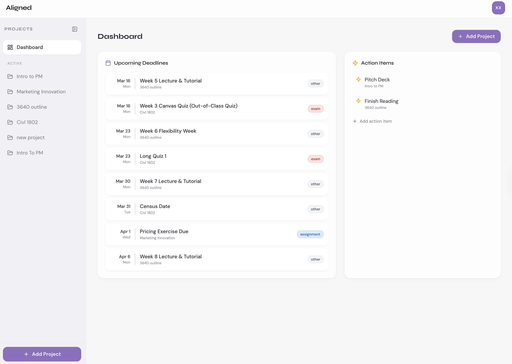
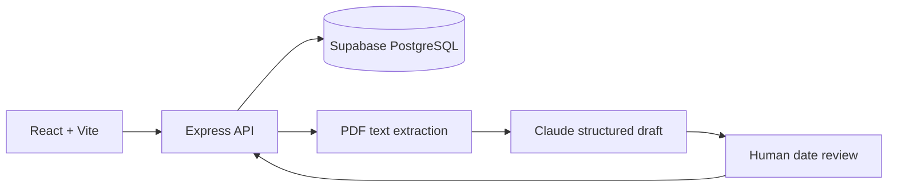

# Aligned

An AI-assisted coordination workspace that helps student teams turn a syllabus into a shared plan, with deadlines, action items, documents, and communication links in one place.

[Product site](https://aligned-teams.org) · [Demo video](./Demo.MOV) · [Katherine's portfolio](https://katherinexu.me)



## Why this product

Student teams spread course requirements, decisions, and documents across several tools. Aligned starts with syllabus deadline extraction so a team gets a useful shared timeline before it has to maintain another workspace. Scheduling was deferred because it requires more setup and participation before delivering value.

This was a MIT Sloan product-management course project, built and deployed as an MVP in two weeks. It is a completed course MVP and early pilot, not a claim of sustained adoption.

## My contribution

**Katherine Xu:** interviewed MIT Sloan and Harvard graduate students, defined a seven-feature roadmap, and prioritized the first usable workflow. I owned deployment to Vercel and Supabase and built the public landing site. **A teammate built the core application.**

Getting the Replit prototype into production involved bundling the API with esbuild, resolving ESM/CommonJS compatibility, pinning a PDF parser compatible with the server runtime, and fixing login sessions behind Vercel's proxy. I also addressed syllabus-analysis timeouts and awaited email notifications before a serverless function returned.

An eight-user pilot reported **100% task completion** and a **30% reduction in coordination time**. These are reported results from a small early pilot, not a controlled effectiveness study or evidence of long-term retention.

## Workflow

1. Create a project and upload a syllabus PDF or paste its text.
2. Review AI-extracted milestones against source quotes. Unclear dates stay blank; add a date or exclude the item.
3. Confirm the selected dates before saving the timeline. Re-analysis leaves the current timeline intact until a reviewed replacement is saved.
4. Invite teammates, share action items, and link the documents and communication tools the team already uses.

Slack, Discord, Drive, Notion, and other resources are **links in a shared hub**, not native two-way integrations.

## Architecture



React, Tailwind CSS, and wouter provide the UI. Express, Passport sessions, and Drizzle ORM handle the backend. Claude extracts syllabus milestones. Vercel hosts the application and a separate landing site.

The prototype's SSE broadcaster keeps clients in process memory. On serverless deployments, cross-instance broadcasts and long-lived connections are limited; this MVP does not guarantee real-time delivery across instances. Refreshing the project retrieves saved state.

## Run locally

Use **Node.js 22.12+** and a dedicated PostgreSQL development database. An Anthropic API key is required only for live syllabus analysis.

```bash
git clone https://github.com/qxh2001/aligned.git
cd aligned
npm ci
cp .env.example .env
```

Set `DATABASE_URL` for local PostgreSQL, or `SUPABASE_DATABASE_URL` for a development Supabase pooler. Set a long random `SESSION_SECRET` and your own `ANTHROPIC_API_KEY`. Keep real credentials out of Git.

```bash
# Creates/updates tables in the database configured in .env.
# Review the proposed schema changes; use a development database.
npm run db:push
npm run dev
```

Open `http://localhost:5000`. Passport's session store creates its session table at startup. SMTP notifications are optional; see `.env.example`.

For an existing installation, the added quota table and deadline source fields have an additive SQL migration at [`migrations/ai_usage.sql`](./migrations/ai_usage.sql). Apply and verify it on staging before deploying the new API. No production database is changed by cloning or building this repository.

Use the [rollout and rollback checklist](./docs/rollout.md) before merging a deployment change.

## Reliability and cost controls

- AI analysis returns a draft and never directly overwrites the saved timeline. All selected dates require human confirmation. Saved milestones retain their source quotes for later inspection.
- The server checks that source quotes occur in the supplied text and validates calendar dates. These checks cannot prove the model interpreted a source correctly.
- Anonymous analysis is disabled by default. `ALLOW_PUBLIC_AI_DEMO=true` explicitly enables it under the same quota system.
- PostgreSQL counters enforce five requests per actor per hour and a shared 100-request daily ceiling by default. The limits are configurable, use fixed windows, and persist across service instances. Rejected/invalid attempts may consume a reservation; each accepted analysis can make at most two model calls.
- Inputs are limited to 10 MB PDFs and 50,000 extracted characters, with a 45-second overall model-call deadline. Provider failures are sanitized. A quota-store outage fails closed.
- No raw IP address or syllabus text is written to the quota table. Anonymous actors use keyed hashes and old actor rows are removed.

The remaining build-tool dependency findings and upgrade scope are documented in [dependency-status.md](./docs/dependency-status.md).

Use provider-side spending controls as well: request quotas bound calls, not an exact dollar budget.

## Checks and evaluation

```bash
npm run check
npm test
npm run build
npm run vercel-build
```

GitHub Actions runs these checks with a disposable PostgreSQL service. Tests cover unsupported dates, source grounding, retry bounds, quota enforcement, and concurrent budget reservations. Database tests require `TEST_DATABASE_URL` pointing to an empty **test-only** database; they truncate the test quota table.

A [synthetic extraction evaluation set and offline date scorer](./evals/README.md) cover explicit, incomplete, relative, and adversarial inputs.

These checks test software behavior, not extraction accuracy. An evaluation set should compare extracted milestones to annotated syllabus references, including ambiguous dates, missing years, scanned PDFs, and conflicting instructions. Report date precision/recall and error cases before claiming reliable AI performance.

## License

The project declares MIT in its package metadata. See [LICENSE](./LICENSE).
